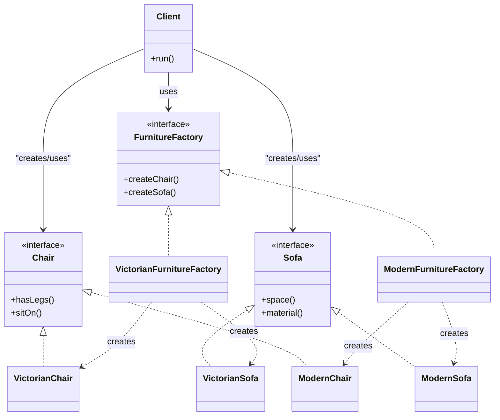

# Abstract Factory Pattern – Java Example

## Overview

The **Abstract Factory** is a creational design pattern used to create *families of related objects* without specifying their concrete classes.

Instead of instantiating objects directly, the client works only with the interfaces:

- `Chair`
- `Sofa`
- `FurnitureFactory`

Concrete families such as *Modern* or *Victorian* implement these interfaces, allowing the client to remain completely decoupled from the concrete implementations.

---

## Class Diagram



---

## When to Use Abstract Factory

Use the Abstract Factory pattern when:

- You need to produce families of related or dependent objects.
- You want to enforce consistency across products (e.g., all Victorian furniture).
- The client must remain independent from concrete classes.
- You want to follow SOLID principles, especially the Open/Closed and Dependency Inversion principles.
- You want to support multiple configurations or styles (e.g., Modern, Victorian, Futuristic).

---

## Relation to SOLID Principles

### Single Responsibility Principle (SRP)
Each factory creates only one family of products.

### Open/Closed Principle (OCP)
You can add a new product family by adding a new factory without modifying existing code.

### Liskov Substitution Principle (LSP)
Concrete products can always be substituted for their interfaces.

### Interface Segregation Principle (ISP)
Each product type has its own interface with the methods it needs.

### Dependency Inversion Principle (DIP)
The client depends only on abstractions (`Chair`, `Sofa`, `FurnitureFactory`), not concrete classes.

---

## Benefits

- Ensures consistency across product families.
- Promotes strong decoupling and flexible architecture.
- Makes adding new product families easy.
- Centralizes object creation logic.

---

## Drawbacks

- Introduces more classes and interfaces.
- Can feel over-engineered for simple object creation.
- Adding a new product type (e.g., `Table`) requires updating every factory.

---

## External Reference

Refactoring Guru provides a full explanation and examples:

https://refactoring.guru/design-patterns/abstract-factory

---

## Does Spring Provide Abstract Factory?

Spring does not ship a specific “AbstractFactory” class because the **IoC container itself replaces the need for it**.

Spring's dependency injection:

- Chooses implementations
- Instantiates objects
- Manages lifecycles
- Resolves dependencies for the client

Much like an abstract factory, but more powerful.

### Example of Spring acting as an Abstract Factory

```java
@Configuration
public class FurnitureConfig {

    @Bean
    @Profile("victorian")
    public FurnitureFactory victorianFactory() {
        return new VictorianFurnitureFactory();
    }

    @Bean
    @Profile("modern")
    public FurnitureFactory modernFactory() {
        return new ModernFurnitureFactory();
    }
}
```


