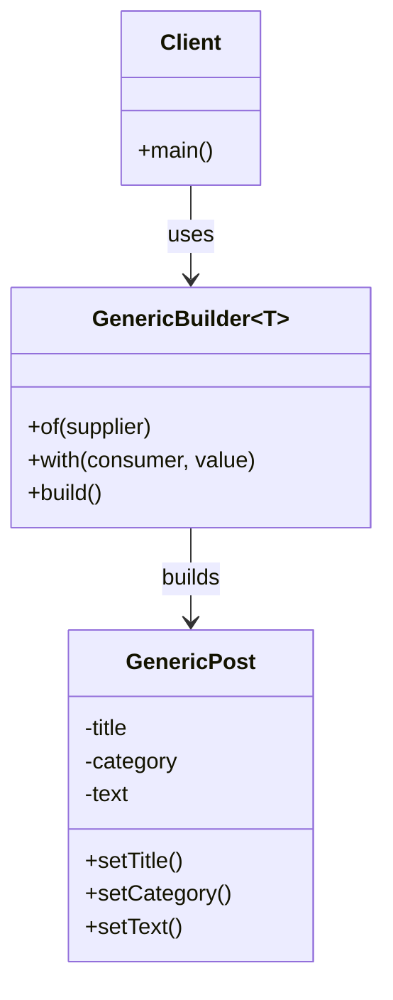

# Builder Pattern – Java Example

## Overview

The **Builder** is a creational design pattern used to construct complex objects *step by step*.

Instead of using large constructors or multiple overloaded constructors, the Builder pattern separates the **construction process** from the **representation**, allowing the same construction process to create different representations.

In this example, a **generic builder** is used to incrementally configure an object using method references and functional interfaces.

---

## Class Diagram



---

## When to Use Builder

Use the Builder pattern when:

- An object has **many optional parameters**
- Constructors would become long or confusing
- You want to build objects **step by step**
- You want readable and fluent object creation
- Object creation logic should be isolated from business logic

---

## Relation to SOLID Principles

### Single Responsibility Principle (SRP)
The builder handles object construction, while the product focuses on its own behavior.

### Open/Closed Principle (OCP)
New configuration steps can be added without modifying existing client code.

### Liskov Substitution Principle (LSP)
The builder can create any valid instance of the product without breaking expectations.

### Interface Segregation Principle (ISP)
The client interacts only with the builder methods it needs.

### Dependency Inversion Principle (DIP)
The builder relies on abstractions (`Supplier`, `BiConsumer`) rather than concrete implementations.

---

## Benefits

- Improves readability of object creation
- Avoids telescoping constructors
- Allows immutable or partially mutable objects
- Encourages fluent APIs
- Decouples construction logic from object usage

---

## Drawbacks

- Introduces additional abstraction
- Can be overkill for simple objects
- Slightly more complex than direct instantiation

---

## Example Usage

```java
GenericPost post = GenericBuilder.of(GenericPost::new)
        .with(GenericPost::setTitle, "Java Title")
        .with(GenericPost::setCategory, "Programming")
        .with(GenericPost::setText, "Explaining")
        .build();
```

---

## How It Works (High Level)

- `Supplier<T>` is responsible for **creating the object**
- `BiConsumer<T, P>` represents a **setter method**
- Each `with(...)` call returns a new builder with an accumulated configuration
- `build()` produces the final fully configured object

---

## External Reference

Refactoring Guru provides a full explanation and examples:

https://refactoring.guru/design-patterns/builder

---

## Does Spring Provide Builder Support?

Spring does not enforce the Builder pattern directly, but:

- Builders are commonly used in configuration objects
- Lombok’s `@Builder` is widely used in Spring projects
- Spring encourages fluent and declarative configuration styles

### Example with Lombok

```java
@Builder
public class GenericPost {
    private String title;
    private String category;
    private String text;
}
```

---

### Final Notes

This example demonstrates a **fluent, functional-style Builder** implementation using Java functional interfaces.

It is especially useful when:
- You want immutability-friendly construction
- You want reusable, generic builders
- You want clean and expressive object creation
