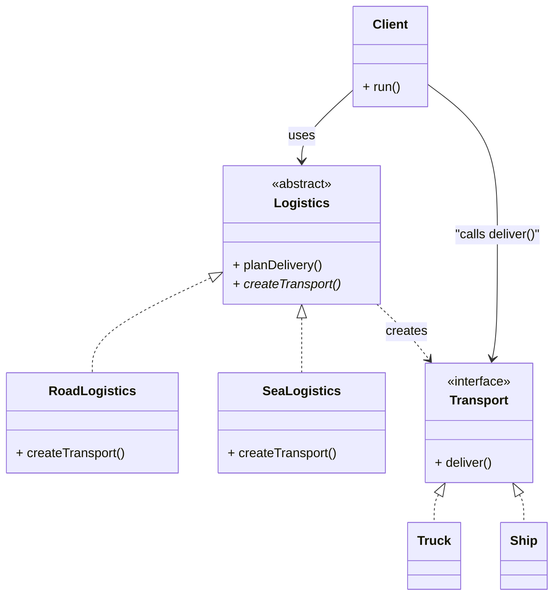

# Factory Method Pattern – Java Example

## Overview
The Factory Method is a creational design pattern that defines an interface for creating objects, but allows subclasses to decide which concrete class will be instantiated.

Instead of calling a constructor directly (`new`), the client calls a factory method.  
This shifts the responsibility of object creation to subclasses, improving flexibility and reducing coupling.

In this example, `Logistics` is the *Creator* and defines the `createTransport()` factory method.  
Concrete creators (`RoadLogistics`, `SeaLogistics`) override it to decide whether to produce a `Truck` or a `Ship`.  
`Transport` is the Product interface implemented by the concrete products.

## Class Diagram

## When to Use Factory Method

Use Factory Method when:

- A class cannot anticipate the type of objects it must create.
- You want subclasses to decide how objects are created.
- You want to avoid coupling your code to concrete classes.
- You want to follow the Dependency Inversion Principle by depending on abstractions.
- A framework or library needs to allow end users to extend creation behavior.

---

## Relation to SOLID Principles

### Single Responsibility Principle (SRP)
Object creation logic is placed in factory subclasses rather than mixed with business logic.

### Open/Closed Principle (OCP)
New types of products or creators can be introduced without modifying existing code.

### Liskov Substitution Principle (LSP)
Concrete creators (`RoadLogistics`, `SeaLogistics`) must fully replace the abstract creator (`Logistics`) without changing behavior expected by the client.

### Interface Segregation Principle (ISP)
The Product interface (`Transport`) exposes only what clients need.

### Dependency Inversion Principle (DIP)
Clients depend on abstractions (`Transport`, `Logistics`), not concrete implementations.

---

## Benefits

- Decouples product creation from the client.
- Supports introducing new product types without modifying existing code.
- Encourages use of interfaces and abstraction.
- Makes code more flexible and testable.

---

## Drawbacks

- Requires additional classes (creators and products).
- Can become overly complex when used excessively.
- Logic may be split across many small subclasses.

---

## External Reference

Refactoring Guru – Factory Method Pattern  
https://refactoring.guru/design-patterns/factory-method

---

## Does Spring Provide Factory Method?

Spring does not use GoF Factory Method literally, but it embodies the concept through:

- `@Bean` methods (factory methods inside `@Configuration` classes)
- `FactoryBean<T>` interface (real Spring factory hook)
- IoC container managing object creation instead of your code

In modern Spring applications, the need for GoF Factory Method is rare.

## FactoryBean Example in Spring

Below is an example of how Spring’s `FactoryBean<T>` can act as a customizable factory method.

### Goal
Create a `Transport` object using a Spring factory instead of manually calling constructors.

---

### 1. Product Interface

```java
public interface Transport {
    void deliver();
}
```

---

### 2. Concrete Products

```java
public class Truck implements Transport {
    private final String model;

    public Truck(String model) {
        this.model = model;
    }

    @Override
    public void deliver() {
        System.out.println("Delivering cargo by truck: " + model);
    }
}
```

```java
public class Ship implements Transport {
    private final String name;

    public Ship(String name) {
        this.name = name;
    }

    @Override
    public void deliver() {
        System.out.println("Delivering cargo by ship: " + name);
    }
}
```

---

### 3. Abstract Creator (GoF)

```java
public abstract class Logistics {
    public void planDelivery() {
        Transport transport = createTransport();
        transport.deliver();
    }

    protected abstract Transport createTransport();
}
```

---

### 4. Concrete Creators (Road & Sea)

These normally instantiate concrete classes directly, but with Spring we **delegate creation to FactoryBeans**.

```java
public class RoadLogistics extends Logistics {

    private final Transport truck;

    public RoadLogistics(Transport truck) {
        this.truck = truck;
    }

    @Override
    protected Transport createTransport() {
        return truck;
    }
}
```

```java
public class SeaLogistics extends Logistics {

    private final Transport ship;

    public SeaLogistics(Transport ship) {
        this.ship = ship;
    }

    @Override
    protected Transport createTransport() {
        return ship;
    }
}
```

---

### 5. FactoryBeans for Truck and Ship

Spring now controls creation logic.

### TruckFactoryBean

```java
import org.springframework.beans.factory.FactoryBean;

public class TruckFactoryBean implements FactoryBean<Transport> {

    private String model;

    public void setModel(String model) {
        this.model = model;
    }

    @Override
    public Transport getObject() {
        return new Truck(model != null ? model : "Default-Truck");
    }

    @Override
    public Class<?> getObjectType() {
        return Transport.class;
    }

    @Override
    public boolean isSingleton() {
        return true;
    }
}
```

### ShipFactoryBean

```java
import org.springframework.beans.factory.FactoryBean;

public class ShipFactoryBean implements FactoryBean<Transport> {

    private String name;

    public void setName(String name) {
        this.name = name;
    }

    @Override
    public Transport getObject() {
        return new Ship(name != null ? name : "Default-Ship");
    }

    @Override
    public Class<?> getObjectType() {
        return Transport.class;
    }

    @Override
    public boolean isSingleton() {
        return true;
    }
}
```

---

### 6. Spring Configuration

```java
import org.springframework.context.annotation.Bean;
import org.springframework.context.annotation.Configuration;

@Configuration
public class LogisticsConfig {

    // -------- FactoryBeans --------
    @Bean
    public TruckFactoryBean truckFactoryBean() {
        TruckFactoryBean factory = new TruckFactoryBean();
        factory.setModel("Volvo-X900");
        return factory;
    }

    @Bean
    public ShipFactoryBean shipFactoryBean() {
        ShipFactoryBean factory = new ShipFactoryBean();
        factory.setName("Oceanic-21");
        return factory;
    }

    // -------- Concrete Logistics --------
    @Bean
    public RoadLogistics roadLogistics(Transport truck) {
        return new RoadLogistics(truck);
    }

    @Bean
    public SeaLogistics seaLogistics(Transport ship) {
        return new SeaLogistics(ship);
    }
}
```

---

### Notes

- When you call `context.getBean(Transport.class)`, Spring returns **the object created by the factory**, not the factory itself.
- To get the *factory bean* instance, use the special `&` prefix:
  ```java
  TruckFactoryBean factory = (TruckFactoryBean) context.getBean("&truckFactoryBean");
  ```

---

### Summary

`FactoryBean<T>` is the closest way Spring lets you implement a **true Factory Method**, because:

- You override creation logic.
- Spring calls your method, not your code.
- Beans can be singleton or prototype.
- Clients depend only on the **Transport interface**, fitting DIP.
