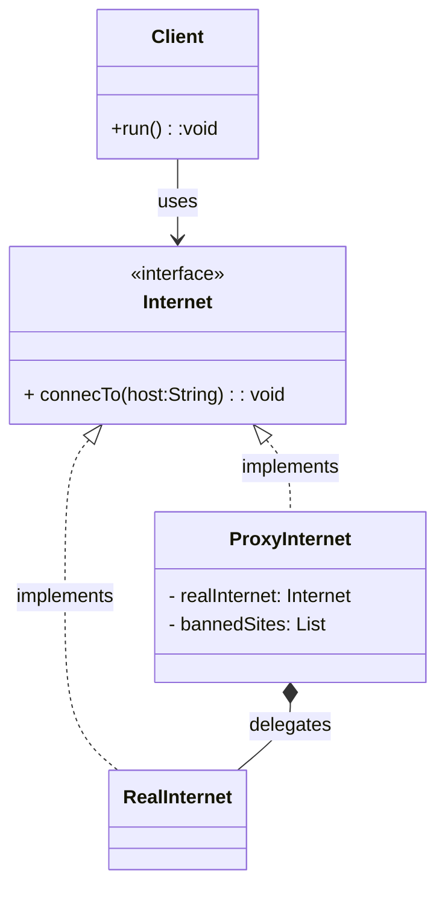

# Proxy Pattern – Java Example

## Overview

The **Proxy** is a structural design pattern that provides a *surrogate or placeholder* for another object to control access to it.

Instead of the client interacting directly with the real object, it communicates through a proxy that implements the same interface.  
The proxy can add additional behavior such as **access control**, **lazy initialization**, **logging**, or **caching**, without changing the real object.

In this example, a `ProxyInternet` controls access to a `RealInternet` by blocking requests to banned websites.

---
## Class Diagram


---
## When to Use Proxy

Use the Proxy pattern when:

- You need to **control access** to an object.
- You want to add behavior **before or after** a request reaches the real object.
- Object creation is expensive and should be **lazy-loaded**.
- You want to protect a resource (security proxy).
- You want to add **logging, monitoring, or caching** transparently.
- You cannot or should not modify the real class.

---

## Relation to SOLID Principles

### Single Responsibility Principle (SRP)
The proxy handles access control, while the real object focuses on its core responsibility.

### Open/Closed Principle (OCP)
You can introduce new proxy behaviors without modifying the real object.

### Liskov Substitution Principle (LSP)
The proxy and the real object can be used interchangeably through the `Internet` interface.

### Interface Segregation Principle (ISP)
The interface exposes only what the client needs (`connectTo`).

### Dependency Inversion Principle (DIP)
The client depends on the abstraction (`Internet`), not on concrete implementations.

---

## Benefits

- Adds behavior without changing the real object.
- Improves security and access control.
- Supports lazy initialization.
- Keeps the client decoupled from concrete implementations.
- Enables cross-cutting concerns (logging, validation, monitoring).

---

## Drawbacks

- Introduces additional classes.
- Can increase complexity if overused.
- Adds an extra level of indirection.
- May slightly impact performance due to delegation.

---

## External Reference

Refactoring Guru provides a full explanation and examples:

https://refactoring.guru/design-patterns/proxy

---

## Does Spring Provide Proxy Support?

Yes — **Spring heavily relies on proxies** internally.

Spring uses proxies for:

- `@Transactional`
- `@Async`
- `@Cacheable`
- Security (`@PreAuthorize`)
- AOP (logging, metrics, auditing)

### Example: Spring Proxy via AOP

```java
@Service
public class RealInternet implements Internet {

    @Override
    public void connectTo(String host) {
        System.out.println("Connecting to " + host);
    }
}
```
Spring creates a proxy at runtime to intercept method calls and apply cross-cutting concerns **without modifying the original class**.

⚠️ Note:  
Spring proxies are usually created dynamically (JDK or CGLIB), while the Proxy pattern shown here is a **static, manual proxy**.

---

## Proxy vs Decorator (Common Confusion)

- **Proxy** controls access to an object.
- **Decorator** adds responsibilities to an object.

Both wrap another object and implement the same interface, but their *intent* is different.

---

## Final Notes

This example demonstrates a **Protection Proxy**, one of the most common proxy variants.  
Other types include:

- Virtual Proxy
- Remote Proxy
- Caching Proxy
- Smart Reference Proxy
